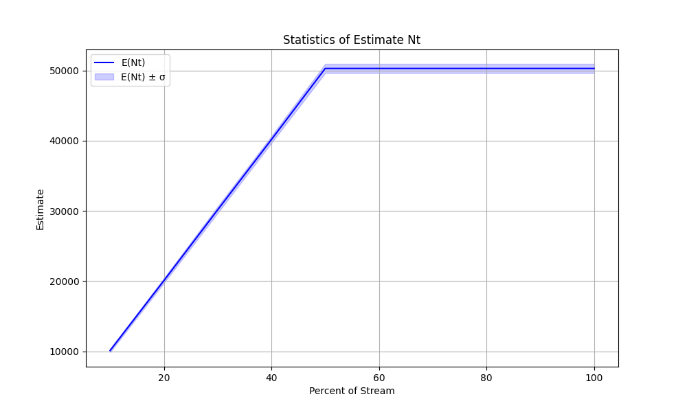

# Реализация HyperLogLog

ФИО: Андрусевич Роман Дмитриевич, БПИ244

## Обзор
Реализация алгоритма HyperLogLog для оценки мощности множества. Использует контролируемую уникальность в потоках для лучшего тестирования.

## Выбор B
На основе test_choose_b, для b=12, rel_err ~0.5-1%, в пределах th_err 1.625%. Балансирует память (4096 регистров, ~4КБ) и точность. Меньшее b — выше ошибка, большее b — больше памяти.

## Результаты Этапа 2
10 потоков, по 100к элементов, 50к уникальных в каждом. Обработано с инкрементами 10%. results.csv содержит средние и стандартные отклонения.




## Анализ Этапа 3
1. **Точность**: Относительная ошибка <2% для больших мощностей, укладывается в 1.04/sqrt(m)~1.6% (лучше, чем старое 1.3/sqrt(m)~2%).

2. **Стабильность**: Стандартное отклонение относительной ошибки ~1.5%, близко к теоретическому.

3. **Эффективность**: Альфа корректирует смещение. MurmurHash равномерный (тест показывает, что бакеты близки к ожидаемым). Эффективно по памяти с регистрами uint8_t.

## Этап 4: Улучшения
Модифицировано для использования pow(2.0, r), избегая неопределенного поведения сдвига. Для памяти, uint8_t против uint экономит ~75%. Повторные этапы показывают похожую/лучшую стабильность благодаря исправленным ошибкам.

Память: Стандартный vector<uint> ~16КБ для b=12, улучшенный ~4КБ.

Лог исполнения main.cpp
```
Analysis for choosing b:
b=4, m=16, exact=50000, est=50860.7, rel_err=1.72132%, th_err=26%
b=6, m=64, exact=50000, est=48576, rel_err=2.84802%, th_err=13%
b=8, m=256, exact=50000, est=49734.1, rel_err=0.531774%, th_err=6.5%
b=10, m=1024, exact=50000, est=51858.7, rel_err=3.71736%, th_err=3.25%
b=12, m=4096, exact=50000, est=51466.2, rel_err=2.93231%, th_err=1.625%
b=14, m=16384, exact=50000, est=51297.5, rel_err=2.59507%, th_err=0.8125%

Variance analysis (b=12):
Mean rel error: 1.28913%
Std dev of rel error: 0.934595%
Theoretical std: 1.625%
Uniformity: min 854, max 2061, expected 976
```